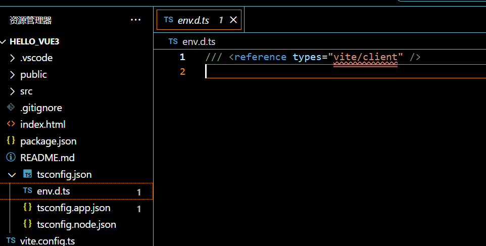

# `Vue3-learn`

# 第一节课【课程介绍】

本次采用`TypeScript` + 组合式`API` + `setup`语法糖

以新为准

# 第二节课【`Vue3`简介】

版本`3.3.4`版本

# 第三节课【创建`Vue3`工程】

## 基于`vue-cli`创建

## 基于`vite`创建【使用】

+ 官方文档`https://vitejs.cn`

+ 下载`nodejs`，为了使用`npm`
  本机版本`v20.18.0`

+ 创建工程
  ```shell
  PS E:\User\wzy\github\Vue3-learn> npm create vue@latest
  Need to install the following packages:
  create-vue@3.12.2
  Ok to proceed? (y) y
  
  
  > npx
  > create-vue
  
  
  Vue.js - The Progressive JavaScript Framework
  
  √ 请输入项目名称： ... hello_vue3
  √ 是否使用 TypeScript 语法？ ... 否 / 是
  √ 是否启用 JSX 支持？ ... 否 / 是
  √ 是否引入 Vue Router 进行单页面应用开发？ ... 否 / 是
  √ 是否引入 Pinia 用于状态管理？ ... 否 / 是
  √ 是否引入 Vitest 用于单元测试？ ... 否 / 是
  √ 是否要引入一款端到端（End to End）测试工具？ » 不需要
  √ 是否引入 ESLint 用于代码质量检测？ » 否
  
  正在初始化项目 E:\User\wzy\github\Vue3-learn\hello_vue3...
  
  项目初始化完成，可执行以下命令：
  
    cd hello_vue3
    npm install
    npm run dev
  
  PS E:\User\wzy\github\Vue3-learn> 
  ```

+ 插件
  ```shell
  Vue Langue Features   	最新的叫`Vue-Official`
  ```

  ```shell
  TypeScript Vue Plugin (Volar)
  ```

+ 爆红解决
  

  输入`npm i`，根据环境安装所有依赖，然后同级目录下会出现一个`node_modules`

  这个文件的作用是，辅助`ts`认识`.txt`、`.jpg`这些文件

+ 运行项目
  ```shell
  PS E:\User\wzy\github\Vue3-learn\hello_vue3> npm run dev
  
  > hello_vue3@0.0.0 dev
  > vite
  
  
    VITE v6.0.2  ready in 627 ms
  
    ➜  Local:   http://localhost:5173/
    ➜  Network: use --host to expose
    ➜  Vue DevTools: Open http://localhost:5173/__devtools__/ as a separate window
    ➜  Vue DevTools: Press Alt(⌥)+Shift(⇧)+D in App to toggle the Vue DevTools
  
    ➜  press h + enter to show help
  ```

+ 停掉项目

  直接`ctrl + C`即可


# 第四节课【编写`vue`组件】

`demo001`

# 第五节课【一个简单的效果】

`vscode`同时修改多行多列，`shift+alt`拖动选择列，然后输入，可以在多行输入相同内容
`demo002`

# 第六课【`OptionsApi`与`CompositionApi`】

之前用的是`OptionsApi`选项式，以后用`CompositionApi`组合式

现象为，可能会出现引入`vue`模块爆红的情况，去`env.d.ts`里添加如下内容

```vue
//这告诉 TypeScript 所有 .vue 文件都应该被当作 Vue 组件来处理。 
declare module "*.vue" {  

    import Vue from 'vue';  

    export default Vue;  

  }
```


# 第七课【setup概述】

`demo003`


# 第八课【setup返回值】
可以用箭头函数返回【不常用】
# 第九课【setup与opentionsApi】
省流说：`setup`不可读`opentionsapi`，但是`opentionsapi`可以读`setup`，因为`setup`周期比`opentionsapi`长，在`beforecreate`前面

# 第10课【setup语法糖】

①`setup`要`return`很多变量、函数名，不方便也不便于维护
所以，新写法为

```vue
<script>
export default{
    name:'Persion'
}
</script>
<script setup>
   //这里的变量不是响应式的
   let name = '张三'
   let age = 18
   let tel = '1000000'
   
   //方法
   function changeName(){
       name = "王子阳"
       console.log(name) //确实修改了，但是页面没变化，因为变量不是响应式的
   }
   function changeAge(){
       age += 1
       console.log(age)
   }
   function showTel(){
       alert(tel)
   }
</script>
```
`export`的`script`是可以省略的，但是这样，文件名字叫什么，这个组件就叫什么，如果想去除他，并且用

```vue
<script setup name="Persion223">
```
需要安装`npm i vite-plugin-vue-setup-extend -D`

并且在`vite.config.ts`里添加并运行【不常用】

```vue
import { fileURLToPath, URL } from 'node:url'

import { defineConfig } from 'vite'
import vue from '@vitejs/plugin-vue'
import vueDevTools from 'vite-plugin-vue-devtools'

// https://vite.dev/config/
export default defineConfig({
  plugins: [
    vue(),
    vueDevTools(),
  ],
  resolve: {
    alias: {
      '@': fileURLToPath(new URL('./src', import.meta.url))
    },
  },
})
```

但是有个简单的方法：可以直接去`vscode`里的插件下载

# 下方预告

+ `ref   =>`    基本数据类型的响应式
+ `reactive     =>`  对象类型的响应式

# 第11课【ref创建基本类型响应式数据】

`demo004`

想让哪个数据变成响应式，就用`ref()`包住它，方法里面要用`$name.value`操作，模板里不需要`.value`

```vue
<template>
    <div class="person">
        <h2>姓名：{{ name }}</h2>
        <h2>年龄：{{ age }}</h2>
        <button @click="changeName">修改名字</button>
        <button @click="changeAge">修改年龄</button>
        <button @click="showTel">显示电话</button>
    </div>
</template>

<script setup name="Person">
    import {ref} from "vue"
   //这里的变量不是响应式的
   let name = ref('张三')
   let age = ref(18)
   let tel = '1000000'
   
   //方法
   function changeName(){
       name.value = "王子阳"
       console.log(name) //确实修改了，但是页面没变化，因为变量不是响应式的
   }
   function changeAge(){
       age.value += 1
       console.log(age)
   }
   function showTel(){
       alert(tel)
   }
</script>
```

# 第12课【reactive创建对象类型的响应式数据】

`demo005`

```vue
<template>
    <div class="person">
        <h1>一辆{{ car.brand }}车，价格是{{ car.price }}万</h1>
        <button @click="chancePrice">增加十万块</button>
    </div>
</template>

<script setup name="Person">
import { reactive } from 'vue';
    let car =  reactive({
        brand:'奔驰',
        price:100
    })
    function chancePrice(){
        car.price +=10
        console.log(car.price)
    }
</script>
```

列表（数组）

数组存储数据，渲染为列表

```vue
<template>
    <div class="person">
        <h1>一辆{{ car.brand }}车，价格是{{ car.price }}万</h1>
        <button @click="chancePrice">增加十万块</button>
        <ul>
            <li v-for="g in games" :key="g.id" >
                {{ g.name }}
            </li>
        </ul>
        <button @click="chanceFirstGamename">修改第一个游戏的名字</button>
    </div>
</template>

<script setup name="Person">
import { reactive } from 'vue';
    let car =  reactive({
        brand:'奔驰',
        price:100
    })
    let games = reactive([
    {id:"wzy01",name:"王者荣耀"},
    {id:"wzy02",name:"元神"},
    {id:"wzy03",name:"黑神话"},
    ])
    function chancePrice(){
        car.price +=10
        console.log(car.price)
    }
    function chanceFirstGamename(){
        games[0].name = '流星蝴蝶剑'
    }
</script>
```

如果有多层次的数据，也是可以直接包裹，然后`reactive`访问

```vue
let obj = {a:{b:{c:666}}}
```

# 第13节课【ref创建对象响应式数据】

`demo006`

`ref`可以定义基本、可以定义对象（`ref`还是求得`reactive`处理的对象类型）

但是注意指针的时机

```vue
<template>
    <div class="person">
        <h1>一辆{{ car.brand }}车，价格是{{ car.price }}万</h1>
        <button @click="chancePrice">增加十万块</button>
        <ul>
            <li v-for="g in games" :key="g.id" >
                {{ g.name }}
            </li>
        </ul>
        <button @click="chanceFirstGamename">修改第一个游戏的名字</button>
    </div>
</template>

<script setup name="Person">
import { ref } from 'vue';
    let car =  ref({
        brand:'奔驰',
        price:100
    })
    let games = ref([
    {id:"wzy01",name:"王者荣耀"},
    {id:"wzy02",name:"元神"},
    {id:"wzy03",name:"黑神话"},
    ])
    function chancePrice(){
        car.value.price +=10
        console.log(car.value.price)
    }
    function chanceFirstGamename(){
        games.value[0].name = '流星蝴蝶剑'
    }
</script>
```

# 第14节课【ref和reactive对比】

demo007

## ref的响应

特点：`value`代理了所有的动作，适合对于数据对象少的情况（多的话，我猜测会对速度造成一些影响)

```vue
<template>
    <div class="person">
        <h1>一辆{{ car.brand }}车，价格是{{ car.price }}万</h1>
        
        <button @click="changeCarName">修改名字</button>
        <button @click="chanceCarPrice">增加十万块</button>
        <button @click="chanceCar">换车</button>
        <ul>
            <li v-for="g in games" :key="g.id" >
                {{ g.name }}
            </li>
        </ul>
    </div>
</template>

<script setup name="Person">
import { ref } from 'vue';
    let car =  ref({
        brand:'奔驰',
        price:100
    })
    function changeCarName(){
        car.value.brand = "宝马"
    }
    function chanceCarPrice(){
        car.value.price += 10
    }
    function chanceCar(){
        car.value = {
        brand:'奥迪',
        price:200
    }
    }
</script>
```

## reactive的响应

特点：对对象中的单个数据比较友好，适合处理表单的情况

```vue
<template>
    <div class="person">
        <h1>一辆{{ car.brand }}车，价格是{{ car.price }}万</h1>
        
        <button @click="changeCarName">修改名字</button>
        <button @click="chanceCarPrice">增加十万块</button>
        <button @click="chanceCar">换车</button>
        <ul>
            <li v-for="g in games" :key="g.id" >
                {{ g.name }}
            </li>
        </ul>
    </div>
</template>

<script setup name="Person">
import { reactive } from 'vue';
    let car =  reactive({
        brand:'奔驰',
        price:100
    })
    function changeCarName(){
        car.brand = "宝马"
    }
    function chanceCarPrice(){
        car.price += 10
    }
    function chanceCar(){
        //如果直接 car = {brand:'奥迪',price:200}
        Object.assign(car,{
        brand:'奥迪',
        price:200
    })
    }
</script>
```

关于选择推荐：

> 1，需要基本类型的响应式数据，只能用`ref`
>
> 2，若需要一个响应式对象，但是数据量少（层级不深）二者均可，我选`ref`
>
> 3，若响应式对象，层级太深，数据太多，用`reactive`


