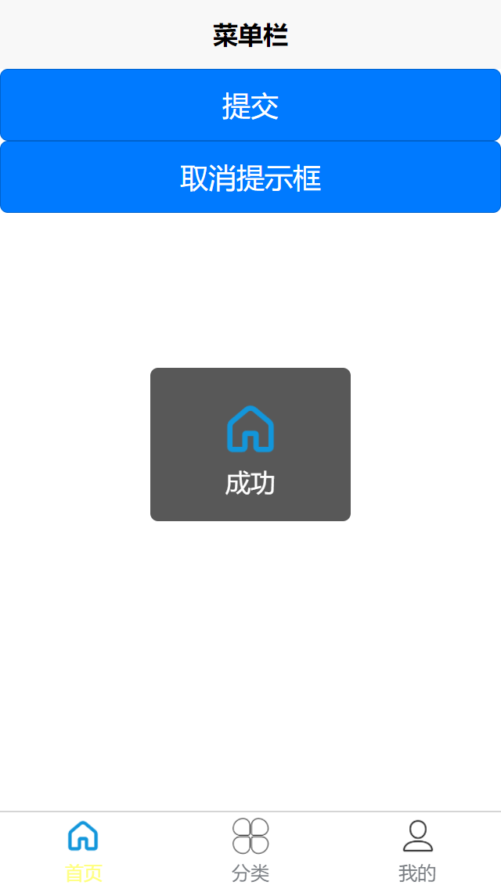
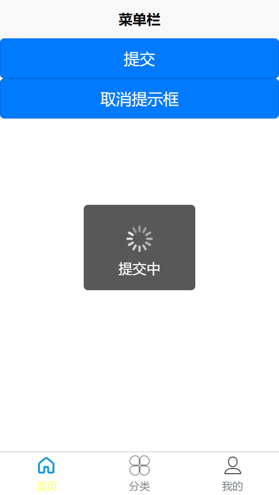
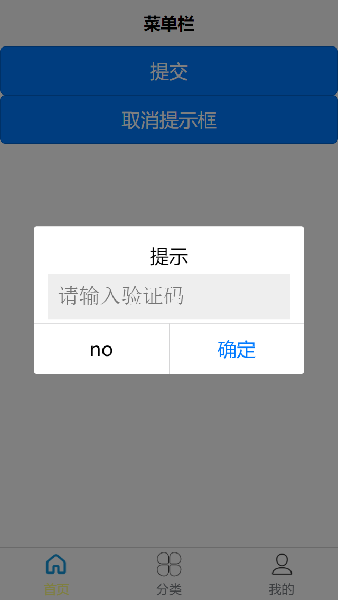
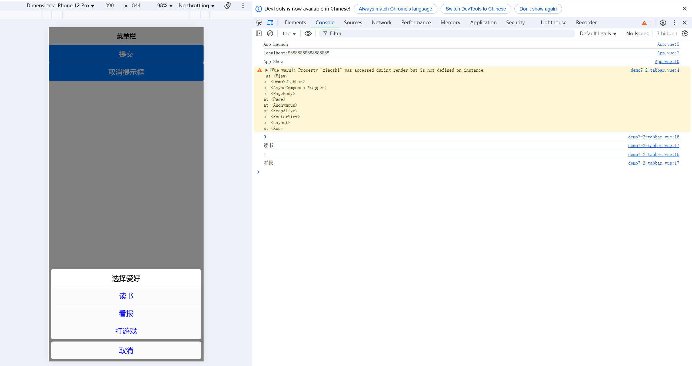
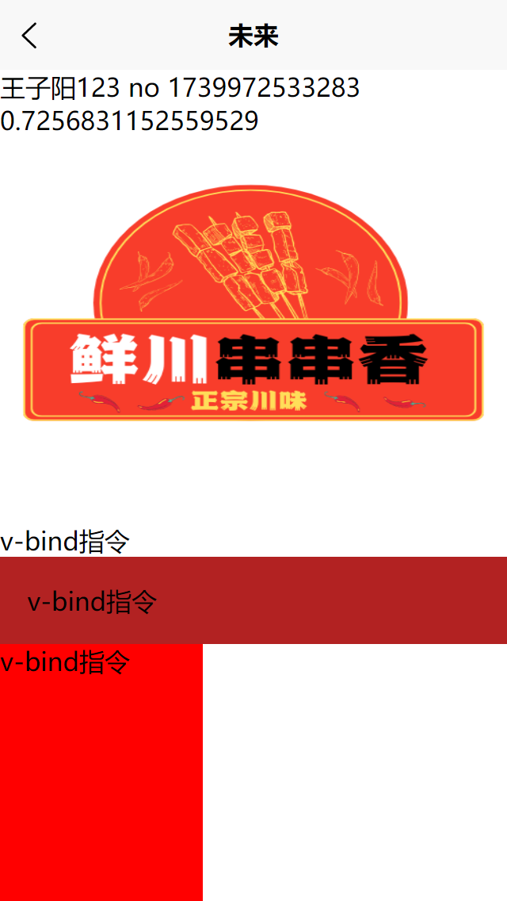

# 关于uniapp的学习

# 六、页面

## 6.1，页面生命周期

## 6.2，对比应用生命周期 App.vue

## 6.3， 路由

## 6.4， 页面调用接口1

### 6.4.1， getApp()

### 6.4.2， getCurrentPages()

# 七、uniapp全局文件

## 7.1，pages.json页面路由

### 7.1.1 globalStyle属性

### 7.1.2 pages 设置页面路径及窗口表现

### 7.1.3 tabBar底部菜单

## 7.2，mainfest.json应用配置

## 7.3，main.js uniapp入口文件

## 7.4，App.vue uniapp主组件/应用入口文件

## 7.5，vite.config.js文件

## 7.6 uni.scss文件 scss和scoped

# 八、uniapp API调用

> 第八章参考地址：[uni交互反馈| uni-app官网](https://uniapp.dcloud.net.cn/api/ui/prompt.html)

## 8.1 uni.showToast()

```vue
<template>
	<view>
		<button type="primary" @click="submit">提交</button>
		<button type="primary" @click="xiaoshi">取消提示框</button>
	</view>
</template>

<script setup>
	function submit() {
		uni.showToast({
				title: "成功",
				image: '/static/icon/home_yes.png',
				// mask:true
				//回调函数
				success() {
					console.log("成功")
				}
			})
		}

		function xiaoshi() {
			uni.hideToast()	//很少用
		}
</script>

<style>

</style>
```



| 字段      | 参数                       | 作用                                             |
| --------- | -------------------------- | ------------------------------------------------ |
| `icon`    | `error`、`none`、`success` | 弹框中显示为感叹号、纯文字、默认对勾             |
| `image`   | 图片路径                   | 将弹框中的符号设置为自定义图片                   |
| `mask`    | 默认为`false`              | 为`true`时，弹框存在的情况下无法点击到图片背后的 |
| `success` | 无                         | 弹框成功显示的回调函数                           |

## 8.2 uni.showLoading()

> 加载转圈圈

```vue
<template>
	<view>
		<button type="primary" @click="submit">提交</button>
		<button type="primary" @click="xiaoshi">取消提示框</button>
	</view>
</template>

<script setup>
	function submit() {
		uni.showLoading({
			title:"提交中"
		})
		}
</script>

<style>

</style>
```




## 8.3 uni.showModal()

> 点击按钮后，会出现一个取消/确认的弹框，就是此功能

```vue
<template>
	<view>
		<button type="primary" @click="submit">提交</button>
		<button type="primary" @click="xiaoshi">取消提示框</button>
	</view>
</template>

<script setup>
	function submit() {
		uni.showModal({
			title:"提示",
			// content:"即将进行提交操作",
			// showCancel:false	,//如果为false则只显示一个确定按钮
			cancelText: 'no'	,//取消按钮的文字
			editable:true,
			placeholderText:'请输入验证码',
			success(res) {
				console.log(res)
				if(res.confirm){
					console.log(res.content)
					uni.showToast({
						title:'提交成功'
					})
				}else{
					uni.showToast({
						title:'取消成功'
					})
				}
			}
		})
		}
</script>

<style>

</style>
```



## 8.4 uni.showActionSheet()

> 点击按钮后，从下方弹出选择菜单

```vue
<template>
	<view>
		<button type="primary" @click="submit">提交</button>
		<button type="primary" @click="xiaoshi">取消提示框</button>
	</view>
</template>

<script setup>
	let arrs = ["读书","看报","打游戏"]
	function submit() {
		uni.showActionSheet({
			title:'选择爱好',
			itemList:arrs,
			itemColor:"#0004fc",
			success(res){
				console.log(res.tapIndex)
				console.log(arrs[res.tapIndex])
			}
		})
		}
</script>

<style>

</style>
```



## 8.5 设置导航条

> 动态设置界面上方的标题

```vue
<template>
	<view>
		<!-- <button type="primary" @click="submit">提交</button>
		<button type="primary" @click="xiaoshi">取消提示框</button> -->
		<navigator url="/pages/demo-vue3/demo-vue3?title=未来">
			跳转界面并设置其标题
		</navigator>
	</view>
</template>

<script setup>
	let arrs = ["读书","看报","打游戏"]
	function submit() {
		uni.showActionSheet({
			title:'选择爱好',
			itemList:arrs,
			itemColor:"#0004fc",
			success(res){
				console.log(res.tapIndex)
				console.log(arrs[res.tapIndex])
			}
		})
		}
</script>

<style>

</style>
```

跳转界面的代码：

```vue
onLoad((event)=>{
		console.log(event)
		uni.setNavigationBarTitle({
			title:event.title
		})
	})
```



```js
onLoad((event)=>{
	console.log(event)
	uni.setNavigationBarTitle({
		title:event.title
	})
	uni.setNavigationBarColor({
		frontColor:"#007aff",
		backgroundColor:"#333"
	})
	// uni.showNavigationBarLoading()//加载图标
})
```

隐藏home只在小程序里需要，因此这里不记录了

## 8.6，设置tabBar

> 关于红点、小红数字的设置和清除

+ 设置

```js
<template>
	<view>
		<!-- <button type="primary" @click="submit">提交</button>
		<button type="primary" @click="xiaoshi">取消提示框</button> -->
		<!-- <navigator url="/pages/demo-vue3/demo-vue3?title=未来">
			跳转界面并设置其标题
		</navigator> -->
		<button type="primary" @click="tabbar">设置红点</button>
	</view>
</template>

<script setup>
	function tabbar(){
		uni.showTabBarRedDot({
			index:1,
		})
		uni.setTabBarItem({
			index:1,
			text:'商品分类'
		})
		uni.setTabBarBadge({
			index:2,
			text:3
		})
	}
</script>

<style>

</style>
```

+ 清除

```vue
<template>
	<view>
		<!-- <button type="primary" @click="submit">提交</button>
		<button type="primary" @click="xiaoshi">取消提示框</button> -->
		<!-- <navigator url="/pages/demo-vue3/demo-vue3?title=未来">
			跳转界面并设置其标题
		</navigator> -->
		<button type="primary" @click="tabbar">设置红点</button>
		<button type="primary" @click="removeTabbar">取消红点</button>
	</view>
</template>

<script setup>
	function tabbar(){
		uni.showTabBarRedDot({
			index:1,
		})
		uni.setTabBarItem({
			index:1,
			text:'商品分类'
		})
		uni.setTabBarBadge({
			index:2,
			text:3
		})
	}
	function removeTabbar(){
		uni.removeTabBarBadge({
			index:2
		})
		uni.hideTabBarRedDot({
			index:1
		})
	}
</script>

<style>

</style>
```

## 8.7，下拉刷新

```js
onPullDownRefresh(()=>{
		console.log('下拉刷新，请求数据')
		//停止刷新，也就是只刷新1秒
		setTimeout(function(){
			uni.stopPullDownRefresh();
		},1000)
	})
```


## 8.8，storageSync数据缓存Api

> 参考地址：[uni.缓存 | uni-app官网](https://uniapp.dcloud.net.cn/api/storage/storage.html)

```vue
<script setup>
	uni.setStorageSync('name','王子阳')
	uni.setStorageSync('people',{name:'王子阳',age:24,address:'河南省'})
	console.log(uni.getStorageSync('name'))
	console.log(uni.getStorageSync('people'))
	uni.removeStorageSync('name')	//运行立即生效
</script>
```


# 九、多个平台打包上线